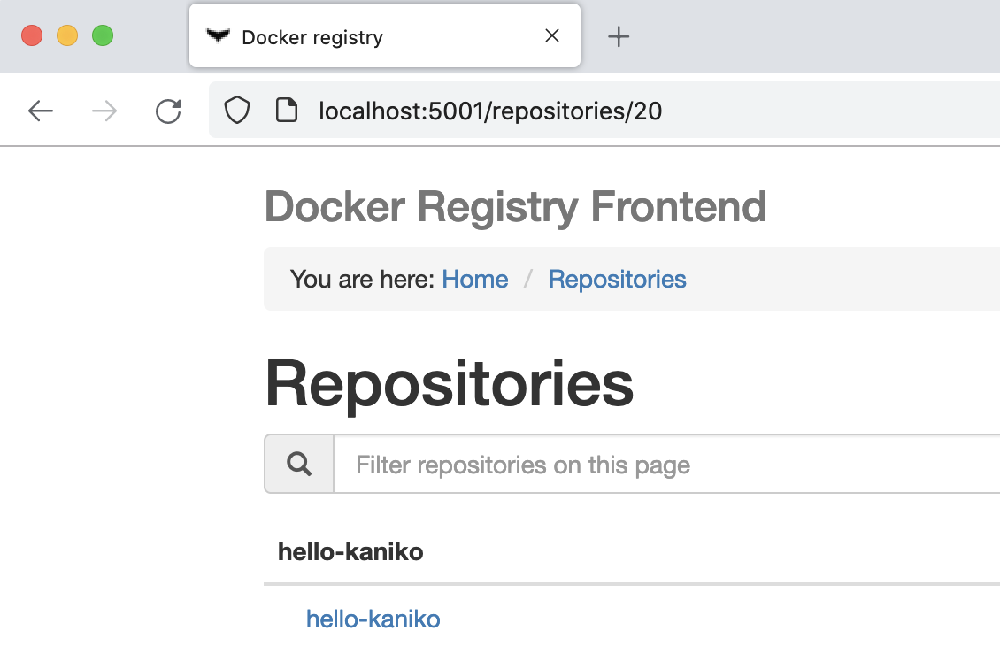
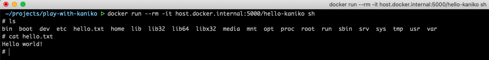

## About

This repository contains basic snippets I used when playing with [Kaniko](https://github.com/GoogleContainerTools/kaniko) project.

- Pushed container image:

    

- Files inside container:

    

## Links

- [Kaniko repository](https://github.com/GoogleContainerTools/kaniko)
- [Run a local container registry](https://docs.docker.com/registry/deploying/#run-a-local-registry)
- [Container image for registry front-end](https://hub.docker.com/r/konradkleine/docker-registry-frontend)
- [Allow insecure local container registry in Docker Engine](https://stackoverflow.com/a/63227959)
